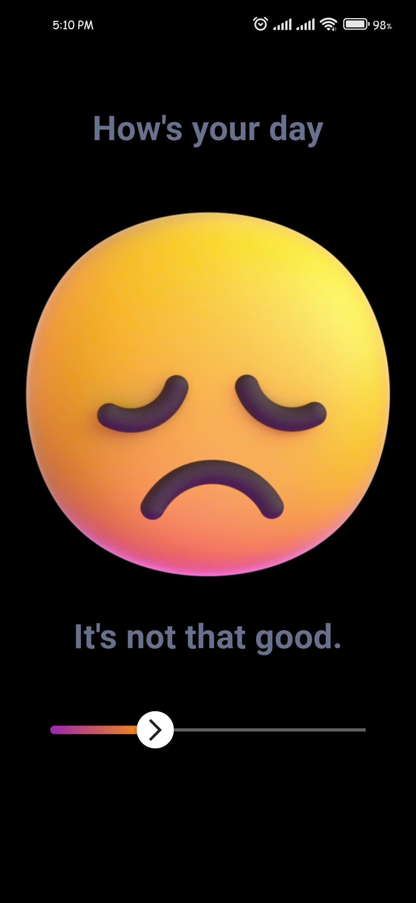

# 🎬 Flutter UI Challenge

This repository contains various UI challenges built using Flutter. Each challenge demonstrates unique UI elements, animations, and transitions to create interactive and visually appealing apps.

Thanks for visiting! Don't forget to **star ⭐** the repository if you like the projects!

###### Contact for work, email: chunhthanhde.dev@gmail.com

 

[![Flutter Journey][logo_black]][flutter_journey_link_black]
[![Flutter Journey][logo_white]][flutter_journey_link_white]

 

## 📝 Requesting a New Challenge

Click [here](https://github.com/Flutter-Journey/Flutter-UI-Challenge/issues/new?assignees=&labels=feature&projects=&template=feature_request.yaml&title=feat%3A+) to request a new challenge.

  

Make sure to describe the context and requirements of your challenge in detail.

## 🏆 Challenges Overview

| Challenge                     | Description                                                                                                                                           | Screenshots                                                                                       | Link                                                                                                   |
| ----------------------------- | ----------------------------------------------------------------------------------------------------------------------------------------------------- | ------------------------------------------------------------------------------------------------- | ------------------------------------------------------------------------------------------------------ |
| Challenge 1: Movie Selection  | A movie selection screen with a horizontal sliding effect. Click to view detailed information including description, ticket price, and showtimes.      |                    | [Demo Video](https://youtube.com/shorts/cHObOQJJ9vA)                                                  |
| Challenge 2: Rating Bar Screen| An animated rating bar with a sliding effect. Provides visual feedback with smooth animations and interactive interface for user rating experiences. |                         | [Demo Video](https://youtube.com/shorts/YF_nQpT840o)                                                  |
| Challenge 3: Foods Selection  | A dynamic food selection screen, displaying dishes in a two-column layout. Interactive cards and a slider enhance the browsing experience.            |                    | [Demo Video](https://youtube.com/shorts/MxfSHX-cTIU)                                                  |
| Challenge 4: Drink Swipe Screen | A drink selection screen with a swipe effect, allowing users to smoothly switch between drinks while updating price information dynamically. |                  | [Demo Video](https://youtube.com/shorts/hob8umTBZ2Y?si=I6xUtYyWf9ItcPsg)                               |

## 📂 Requirements

Each project may have specific requirements and dependencies. Please refer to the individual challenge README for setup instructions.

## ⭐ Star History

<a href="https://star-history.com/#Flutter-Journey/Flutter-UI-Challenge&Date">
 <picture>
   <source media="(prefers-color-scheme: dark)" srcset="https://api.star-history.com/svg?repos=Flutter-Journey/Flutter-UI-Challenge&type=Date&theme=dark" />
   <source media="(prefers-color-scheme: light)" srcset="https://api.star-history.com/svg?repos=Flutter-Journey/Flutter-UI-Challenge&type=Date" />
   
 </picture>
</a>

#### Made by Flutter  with Love ❤️ | Developed by [Flutter Journey](https://github.com/Flutter-Journey)

[logo_black]: https://github.com/Flutter-Journey/.github/raw/main/media/logo_black.png#gh-dark-mode-only
[logo_white]: https://github.com/Flutter-Journey/.github/raw/main/media/logo_white.png#gh-light-mode-only
[flutter_journey_link_white]: https://github.com/Flutter-Journey#gh-light-mode-only
[flutter_journey_link_black]: https://github.com/Flutter-Journey#gh-dark-mode-only

