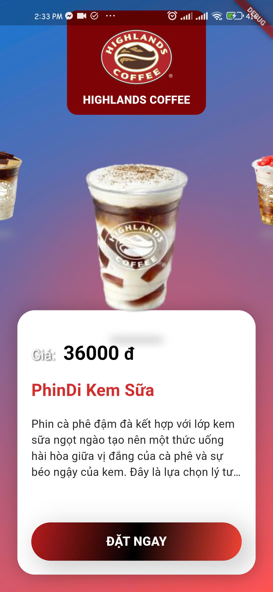

# Drink Swipe Screen

## Challenge 4

This challenge creates a dynamic drink selection screen with a swipe effect between drinks. It provides users with a visually engaging way to explore and select drinks, updating price information dynamically.

## Demo

Watch the demo of the app in action:

[Drink Swipe Demo](https://youtube.com/shorts/hob8umTBZ2Y?si=I6xUtYyWf9ItcPsg)

## Screenshots

| Screenshot 1 | Screenshot 2 | Screenshot 3 |
| ------------ | ------------ | ------------ |
|  |  |  |

## Data 🤒

This screen uses various drink images to enhance user experience with swipe effects. They are collected through the HighLand menu.

https://www.highlandscoffee.com.vn/

#### Made by Flutter  with Love ❤️ | Developed by [ChunhThanhDe](https://github.com/chunhthanhde)

