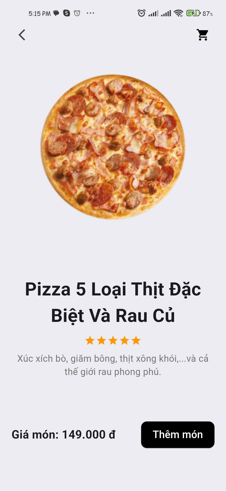
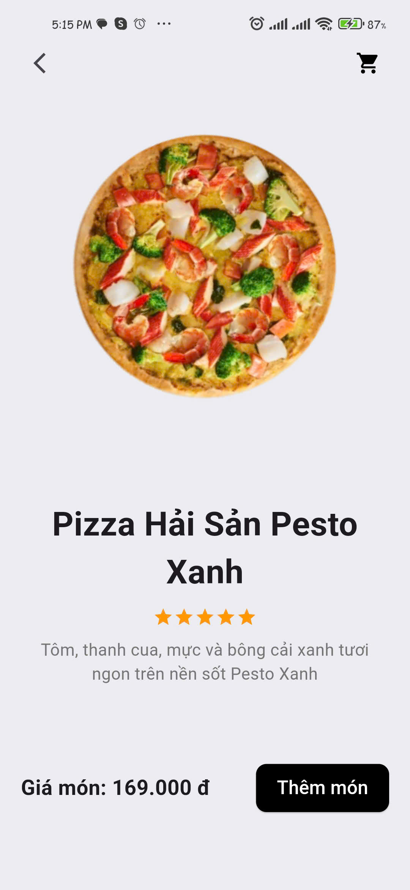
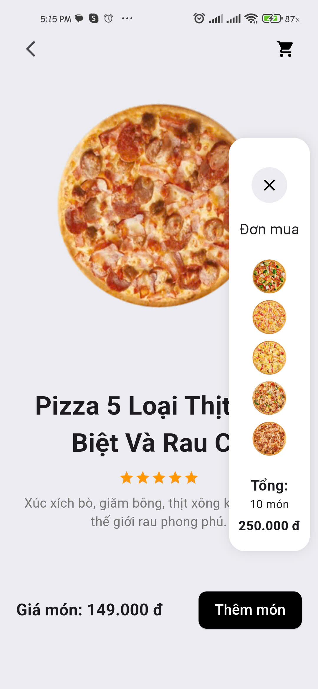
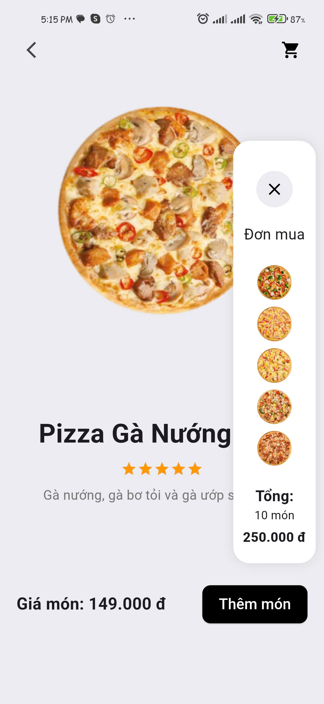

# Foods Selection Screen

## Challenge 3

This challenge presents a dynamic food selection interface, with dishes displayed in an engaging two-column layout. Each dish is represented as a card, and users can slide between different dish options for a seamless browsing experience.

## Demo

Watch the demo of the app in action:

[Foods Selection Demo](https://youtube.com/shorts/MxfSHX-cTIU)

  
 <em> Demo GIF </em> 🍴 

  

    
  

## Screenshots

| Screenshot 1 | Screenshot 2 | Screenshot 3 | Screenshot 4 | Screenshot 5 |
| ------------ | ------------ | ------------ | ------------ | ------------ |
|  |  |  |  |  |

## Data 🥗

Pizza in https://thepizzacompany.vn/

#### Made by Flutter  with Love ❤️ | Developed by [ChunhThanhDe](https://github.com/chunhthanhde)

