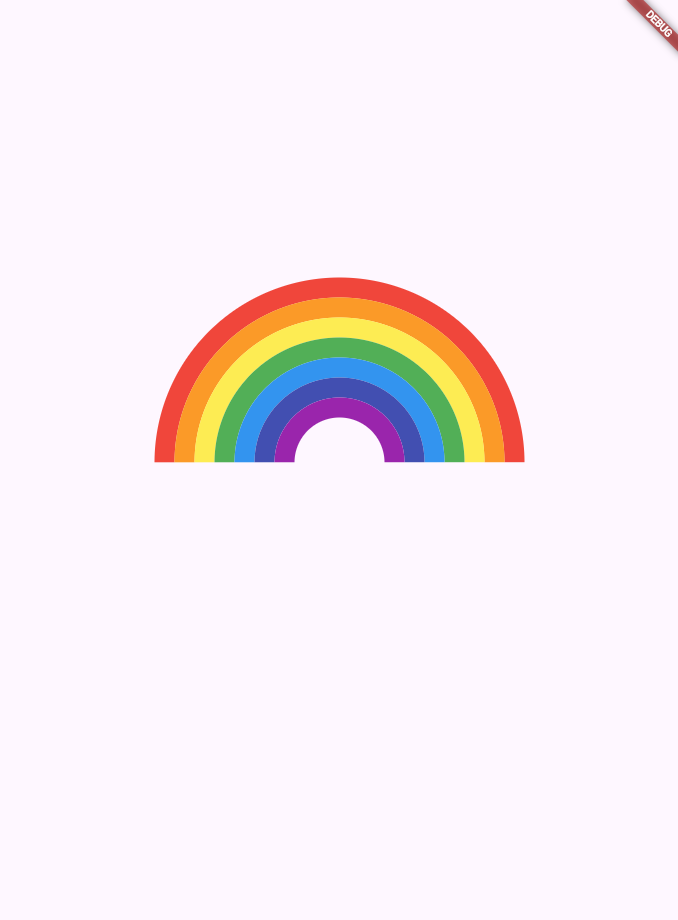

# Rainbow Circular Progress Indicator 🌈

## Challenge 5

This challenge is to create a beautiful and interactive rainbow circular progress indicator. The design features multiple concentric rings with a rainbow color theme. Each ring animates or displays progress, giving a visually engaging effect.

## Screenshots

#### Made by Flutter  with Love ❤️ | Developed by [ChunhThanhDe](https://github.com/chunhthanhde)

