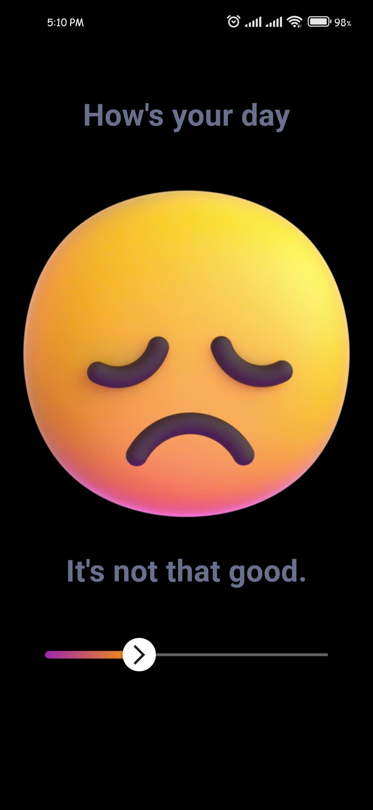
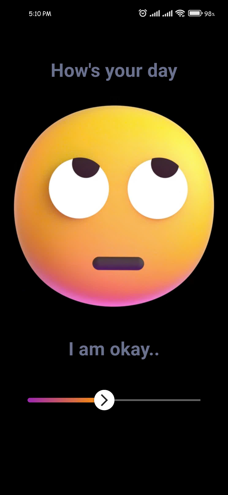
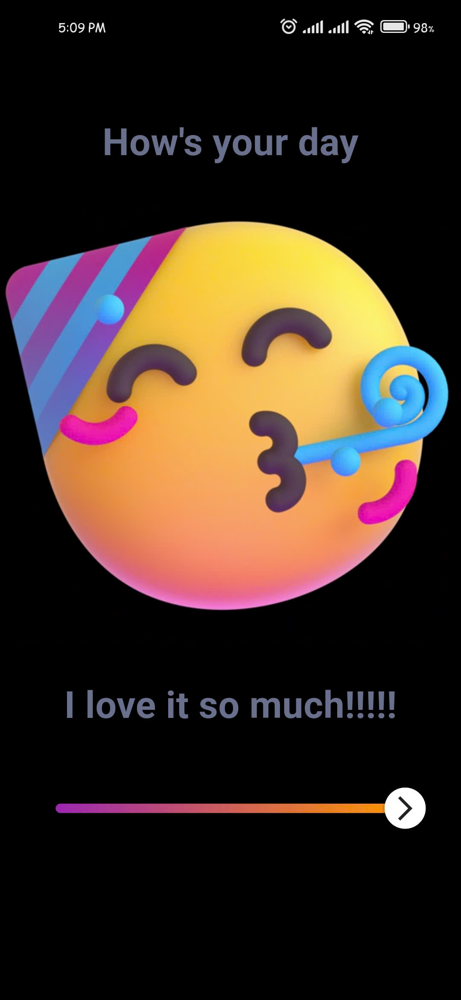
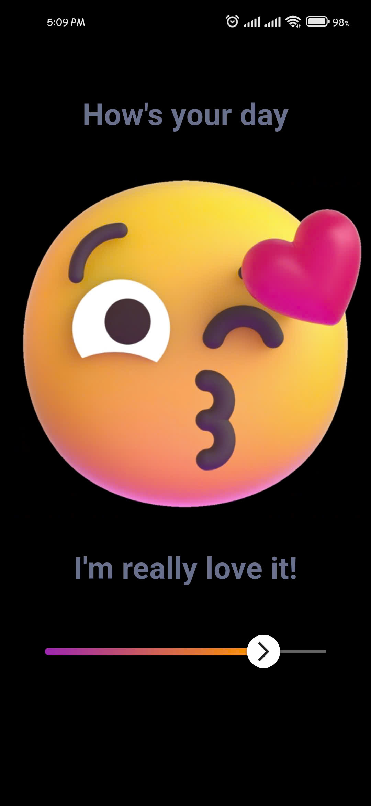
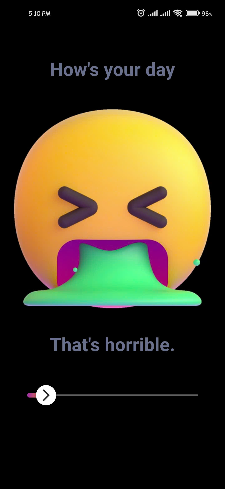

# Rating Bar Screen

## Challenge 2

This challenge show create a cool animated rating bar with a sliding effect. The rating bar provides a visual representation of a user's feedback, with smooth animations and an interactive interface.

## Demo

Watch the demo of the app in action:

[Rating Bar Demo](https://youtube.com/shorts/YF_nQpT840o)

  
 <em> Demo GIF </em> 🕹️ 

  

    
  

## Screenshots

| Screenshot 1 | Screenshot 2 | Screenshot 3 | Screenshot 4 | Screenshot 5 |
| ------------ | ------------ | ------------ | ------------ | ------------ |
|  |  |  |  |  |

## Data 🤒

Check out the emoji reference used in this project for a fun touch:

[Emoji Reference](https://clipchamp.com/collection/522785f5-World-Emoji-Day/element/all/)

#### Made by Flutter  with Love ❤️ | Developed by [ChunhThanhDe](https://github.com/chunhthanhde)

